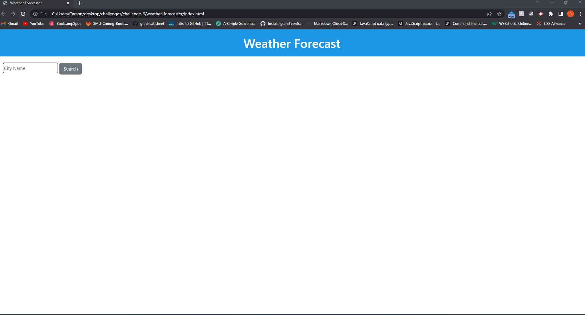

# Weather Forecaster

#### By Carson Loser

#### This application provides the user with weather data from a city of their choice.

# Prerequisites and Dependencies

* When the user enters a city, they are shown present and future weather conditions

* The city that was searched will be saved to the applications search history

* When viewing the current weather conditions, the user is presented with the city name, current date, an icon or image representing the current weather condition, the temperature, the humidity, wind speed, and the UV index.

* User is also provided with a color that indicates whether the conditions are favorable, moderate, or severe.

* When viewing the future weather conditions for a specific city, the user is presented with a 5-day forecast that displays the date, an icon or image that represents the weather conditions, the temperature, the wind speed, and the humidity. 

* When the user clicks in their search history, they are presented with current and future conditions for that city

# Live Server URL

- https://carson-loser.github.io/weather-forecaster/

# Assets

The following image demonstrates the web application's appearance and functionality:

